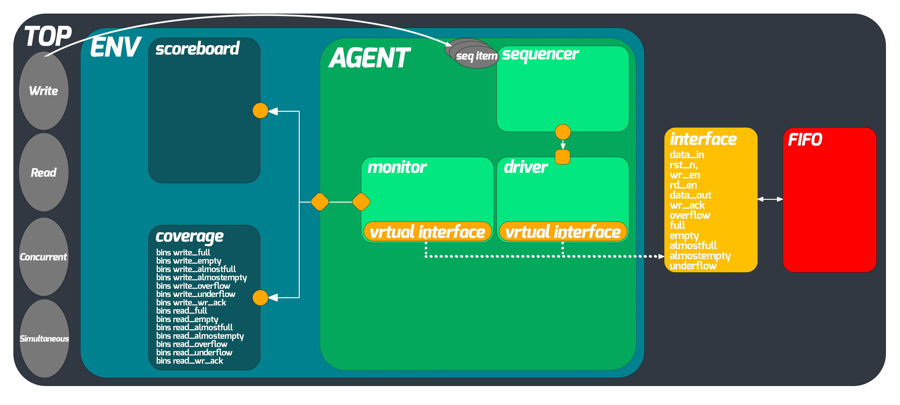

# Complete Top-Level UVM Environment for a Synchronous FIFO

## Overview

This project implements a complete top-level UVM environment for a synchronous FIFO. The FIFO has configurable parameters and ports as described below. The project structure includes documentation, reports, simulation scripts, and the UVM testbench.

## UVM Structure


## Directory Structure

```plaintext
├───Documentation
│       FIFO_UVM_Structure.png 
│       FIFO_UVM_Structure_white_rounded_bg.png
│       Documentation.pdf
│
├───Reports
│       coverage_rpt.txt
│       fcover_report.txt
│       seqcover_report.txt
│
├───Simulation
│       run_FIFO.do
│       src_files.list
│
└───UVM_Testbench
        FIFO.sv
        FIFO_agent.sv
        FIFO_concurrent_sequence.sv
        FIFO_config.sv
        FIFO_coverage.sv
        FIFO_driver.sv
        FIFO_env.sv
        FIFO_if.sv
        FIFO_monitor.sv
        FIFO_read_sequence.sv
        FIFO_ref.sv
        FIFO_reset_sequence.sv
        FIFO_scoreboard.sv
        FIFO_sequencer.sv
        FIFO_seq_item.sv
        FIFO_simult_sequence.sv
        FIFO_SVA.sv
        FIFO_test.sv
        FIFO_top.sv
        FIFO_write_sequence.sv
```

## Parameters

- **FIFO_WIDTH**: DATA in/out and memory word width (default: 16)
- **FIFO_DEPTH**: Memory depth (default: 8)

## Ports

| Port          | Direction | Function                                                                                              |
|---------------|-----------|-------------------------------------------------------------------------------------------------------|
| `data_in`     | Input     | Write Data: The input data bus used when writing the FIFO.                                            |
| `wr_en`       | Input     | Write Enable: If the FIFO is not full, asserting this signal causes data (on `data_in`) to be written into the FIFO. |
| `rd_en`       | Input     | Read Enable: If the FIFO is not empty, asserting this signal causes data (on `data_out`) to be read from the FIFO.   |
| `clk`         | Input     | Clock signal                                                                                          |
| `rst_n`       | Input     | Active low asynchronous reset                                                                         |
| `data_out`    | Output    | Read Data: The sequential output data bus used when reading from the FIFO.                            |
| `full`        | Output    | Full Flag: When asserted, this combinational output signal indicates that the FIFO is full. Write requests are ignored when the FIFO is full. Initiating a write when the FIFO is full is not destructive to the contents of the FIFO. |
| `almostfull`  | Output    | Almost Full: When asserted, this combinational output signal indicates that only one more write can be performed before the FIFO is full. |
| `empty`       | Output    | Empty Flag: When asserted, this combinational output signal indicates that the FIFO is empty. Read requests are ignored when the FIFO is empty. Initiating a read while empty is not destructive to the FIFO. |
| `almostempty` | Output    | Almost Empty: When asserted, this output combinational signal indicates that only one more read can be performed before the FIFO goes to empty. |
| `overflow`    | Output    | Overflow: This sequential output signal indicates that a write request (`wr_en`) was rejected because the FIFO is full. Overflowing the FIFO is not destructive to the contents of the FIFO. |
| `underflow`   | Output    | Underflow: This sequential output signal indicates that the read request (`rd_en`) was rejected because the FIFO is empty. Under flowing the FIFO is not destructive to the contents of the FIFO. |
| `wr_ack`      | Output    | Write Acknowledge: This sequential output signal indicates that a write request (`wr_en`) has succeeded. |

## Verification Requirements

| Label                            | Description                                                                                 | Stimulus Generation                                                                                  | Functional Coverage                                                                                        | Functionality Check                                                                                                           |
|----------------------------------|---------------------------------------------------------------------------------------------|------------------------------------------------------------------------------------------------------|------------------------------------------------------------------------------------------------------------|------------------------------------------------------------------------------------------------------------------------------|
| Only_Write                       | Write unique values to the FIFO while reading is disabled                                   | Constraint `rd_en` to be zero while randomizing `wr_en` to be high most of the time. Constraint `data_in` to have unique values. | Included in `write_seq` that ensures that 8 consecutive writes have taken place                           | Outputs are checked against reference model + `assert_full`, `assert_almostfull` & `assert_wr_ack`                            |
| Only_Read                        | Read the previously written values to the FIFO while writing is disabled                    | Constraint `wr_en` to be zero while randomizing `rd_en` to be high most of the time.                  | Included in `read_seq` that ensures that 8 consecutive reads have taken place                             | Outputs are checked against reference model + `assert_empty` & `assert_almostempty`                                           |
| Concurrent_Write_Read            | Loop containing a sequence of writes followed by another sequence of reads                  | Constraint `rd_en` to be zero while randomizing `wr_en` to be high most of the time                   | Included in `empty_to_not` and `full_to_not` that ensure that a writing sequence took place after a reading sequence and vice versa | Outputs are checked against reference model                                                                                 |
| Simultaneous_Read_Write          | Read and Write simultaneously and check for the flags remaining low                         | Constraint `wr_en` and `rd_en` to be high simultaneously most of the time.                            | Included in `write_read_simlt` cross bin that covers read cross write                                     | Outputs are checked against reference model                                                                                 |
| Write_Full                       | Write to a full FIFO and check for the overflow to be deasserted when `rd_en` is asserted    | When the FIFO is full constraint `wr_en` to be high most of the time and `rd_en` to be low most of the time | Included in `write_full` cross coverage bin that covers write cross full                                   | Outputs are checked against reference model + `assert_overflow`                                                                                                     |
| Read_Empty                       | Read from an empty FIFO and check for the underflow to be deasserted when `rd_en` is asserted | When the FIFO is empty constraint `rd_en` to be high most of the time and `wr_en` to be low most of the time | Included in `read_empty` cross coverage bin that covers read cross empty                                   | Outputs are checked against reference model + `assert_underflow`                                                                                                    |
| Reset                            | In reset cases check for the FIFO to be cleared and empty is asserted and full is deasserted | Constraint `rst` to be activated more frequently while randomizing the other inputs                   | Included in `full_to_empty` bin that covers the transition from a full FIFO to an empty FIFO (possible only if reset is activated) | Outputs are checked against reference model + `assert_count_rst`, `assert_wr_ptr_rst` & `assert_rd_ptr_rst`                  |
| Simultaneous_Read_Write_Full     | When the FIFO is full and reading and writing are taking place simultaneously, then overflow must remain low | When the FIFO is full, constraint `wr_en` and `rd_en` to be high simultaneously most of the time.     | Included in `write_read_simlt_full` cross coverage between `write_read_simlt` and full                     | Outputs are checked against reference model + `assert_overflow`                                                                                                     |
| Simultaneous_Read_Write_Empty    | When the FIFO is empty and reading and writing are taking place simultaneously, then underflow must remain low | When the FIFO is empty, constraint `wr_en` and `rd_en` to be high simultaneously most of the time.    | Included in `write_read_simlt_empty` cross coverage between `write_read_simlt` and empty                   | Outputs are checked against reference model + `assert_underflow`                                                                                                    |
| Read_Write_Randomized            | Perform random sequences of reads and writes to test the FIFO's robustness                   | Randomize inputs without constraints                                                                | Included in `write_nor_read` that covers that write and read are deactivated simultaneously                | Outputs are checked against reference model + `assert_full`, `assert_empty`, `assert_almostfull`, `assert_almostempty`, `assert_overflow`, `assert_underflow`, `assert_wr_ack` |
| Flags_Stability                  | When neither reading nor writing is taking place, flags must remain stable                   | Constraint `rd_en` and `wr_en` to be low most of the time                                            | Included in `write_nor_read` that covers that write and read are deactivated simultaneously                | Outputs are checked against reference model + `assert_full`, `assert_empty`, `assert_almostfull`, `assert_almostempty`, `assert_overflow`, `assert_underflow`, `assert_wr_ack` |

## Documentation

The `Documentation` folder contains detailed project requirements, structure diagrams, and other relevant documents.

## Reports

The `Reports` folder contains coverage reports generated during the verification process:
- `coverage_rpt.txt`: Overall coverage report.
- `fcover_report.txt`: Functional coverage report.
- `seqcover_report.txt`: Sequence coverage report.

## Simulation

The `Simulation` folder contains scripts and lists needed to run the simulation:
- `run_FIFO.do`: DO file for running the simulation.
- `src_files.list`: List of source files used in the simulation.

## UVM Testbench

The `UVM_Testbench` folder contains the SystemVerilog files for the UVM testbench components:
- `FIFO.sv`: FIFO module.
- `FIFO_agent.sv`: UVM agent for the FIFO.
- `FIFO_concurrent_sequence.sv`: Concurrent sequences for the FIFO.
- `FIFO_config.sv`: Configuration for the UVM environment.
- `FIFO_coverage.sv`: Coverage collector for the FIFO.
- `FIFO_driver.sv`: Driver for the FIFO.
- `FIFO_env.sv`: UVM environment for the FIFO.
- `FIFO_if.sv`: Interface for the FIFO.
- `FIFO_monitor.sv`: Monitor for the FIFO.
- `FIFO_read_sequence.sv`: Read sequences for the FIFO.
- `FIFO_ref.sv`: Reference model for the FIFO.
- `FIFO_reset_sequence.sv`: Reset sequences for the FIFO.
- `FIFO_scoreboard.sv`: Scoreboard for the FIFO.
- `FIFO_sequencer.sv`: Sequencer for the FIFO.
- `FIFO_seq_item.sv`: Sequence item for the FIFO.
- `FIFO_simult_sequence.sv`: Simultaneous sequences for the FIFO.
- `FIFO_SVA.sv`: SystemVerilog Assertions for the FIFO.
- `FIFO_test.sv`: Top-level test for the FIFO.
- `FIFO_top.sv`: Top-level module for the FIFO.
- `FIFO_write_sequence.sv`: Write sequences for the FIFO.

## Getting Started

### Prerequisites

- ModelSim/QuestaSim for simulation
- Quartus Prime for synthesis, place-and-route, and timing analysis

### Running Simulations

1. Clone the repository by typing the following command in your terminal
```bash
git clone https://github.com/amrelbatarny/Complete_Top_Level_UVM_Environment_for_a_Synchronous_FIFO
```
2. Open ModelSim/QuestaSim

3. From the `File` menu, click on `Change directory` and navigate to the `Simulation` directory

4. From the `Transcript` window run the following TCL command to run the script file
```tcl
do run_FIFO.do
```

## Contribution

We welcome contributions to this educational project. Feel free to submit pull requests for improvements or additional features.

## Contact

Click on the image below

<a href="https://beacons.ai/amrelbatarny" target="_blank">
  
</a> 
<br>
